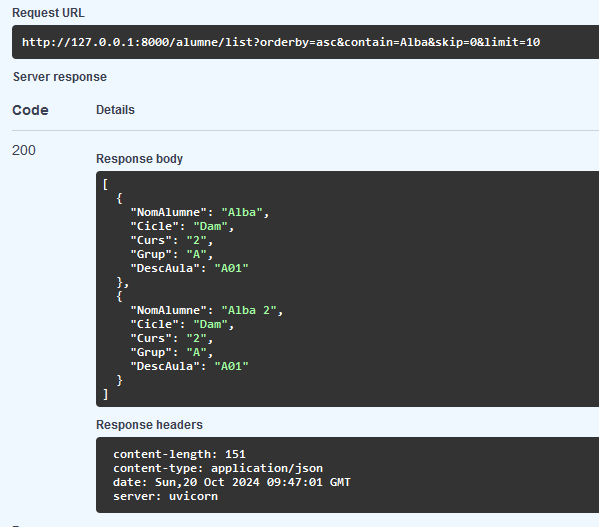
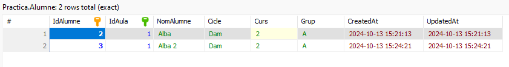
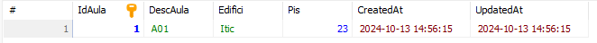
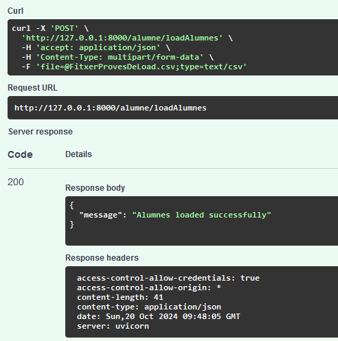
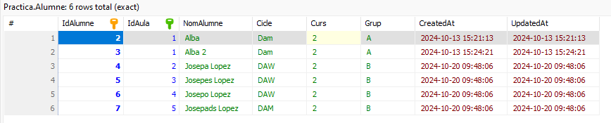
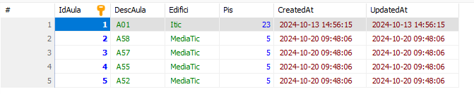

# API Projecte

Aquest projecte és una API desenvolupada amb **FastAPI** per gestionar informació d'alumnes i aules. L'API permet obtenir llistats d'alumnes, informació detallada d'un alumne específic, i informació de totes les aules, a més de modificar i eliminar dades de la base de dades.

> [!IMPORTANT]  
>## Requisits  
>**-Python 3.11.2**  
>**-FastAPI**  
>**-Uvicorn**  
>**-Pydantic**   
>**-Servidor MariaDB**
>**-python-multipart**  

# Nous  EndPoints      
## GET   
1. http://127.0.0.1:8000/alumne/list    
**Retorna una llista d'alumnes amb paràmetres de consulta**

## POST     
1. http://127.0.0.1:8000/alumne/loadAlumnes    
**Carrega alumnes des d'un fitxer CSV**   
**Estat de la base de dades d'Alumne**  
  
**Estat de la base de dades d'Aula**   
  
**Carrega del fitxer**     
  
**Canvis a la base de dades d'Alumne**    
  
**Canvis a la base de dades d'Aula**     
  
